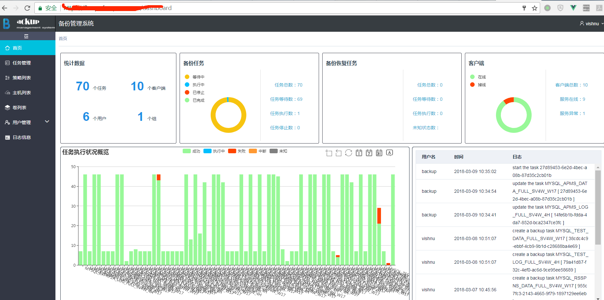
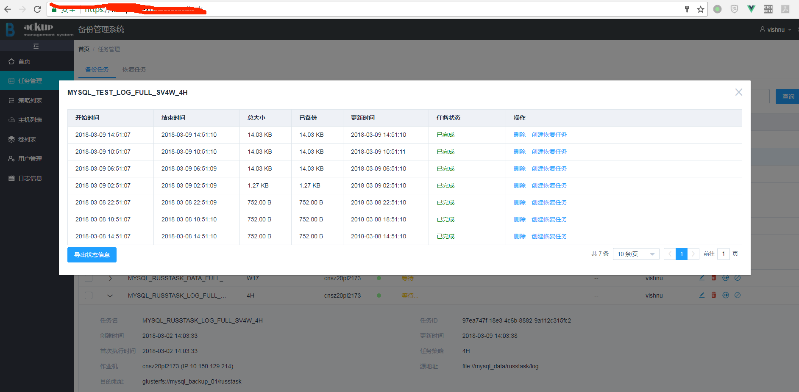
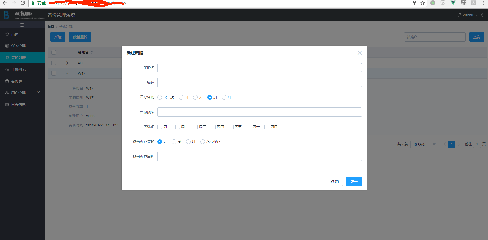
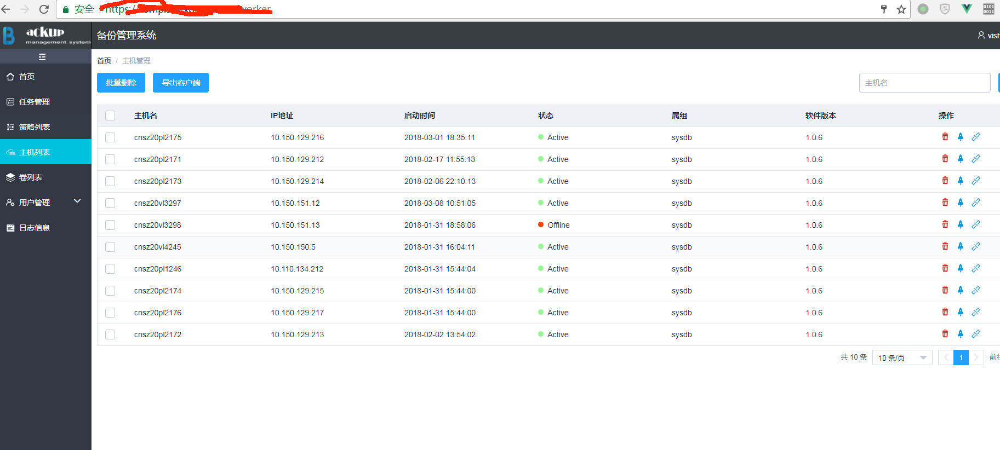

## 部署安装步骤 ##

---

### 一、软件包下载与解压 ###

我们可以从如下地址获取所有需要的安装包

	wget http://xxxx

然后解压

	tar zxf xxxxxxx.tar.gz

进入解压后的目录

	cd  xxxxxxxxxx
	tree        #查看目录结构

可以看到目录结构大致如下所示

    .
    ├── client  #备份客户端程序目录
    │   ├── client.conf		#客户端配置文件
    │   └── ...
    ├── README.md
    ├── requirements.txt	#项目依赖清单
    ├── requirePackages		#依赖包，包含python相关依赖包和Glusterfs fuse client安装依赖的动态库
    │   ├── glusterfs_fuse_packages
    │   │   ├── el6		#适合Centos6.x版本的依赖，包含rpms依赖和Glusterfs Fuse Client编译出来的动态链接库
    │   │   │   └── rpms
    │   │   │   ├──
    │   │   │   └── ...
    │   │   └── el7		#适合Centos7.x版本的依赖
    │   │   └── rpms
    │   │   └── ...
    │   └── pypi			#运行软件所需的所有Python依赖
    │   └── ...
    ├── server			#服务端程序，含web server的服务端程序和备份客户端的服务端程序
    │   ├── ...
    │   ├── etc			#配置文件目录
    │   │   ├── logging.conf
    │   │   ├── policy.json
    │   │   └── server.conf
    │   ├── requirements.txt		#服务端依赖清单
    │   ├── ...
    │   └── web					#前端模块
    │   ├── build				#构建打包配置
    │   │   └── ...
    │   ├── config				#构建打包配置
    │   │   └── ...
    │   ├── dist					#打包后web项目目录
    │   │   ├── index.html
    │   │   └── static
    │   │   └── ...
    │   ├── index.html
    │   ├── node_modules			#web前端项目依赖包
    │   ├── package.json			#web前端项目依赖配置文件
    │   ├── README.md
    │   └── src
    │   ├── api
    │   │   ├── api.js
    │   │   └── index.js
    │   └── ...
    └── setup

我们默认把解压出来的目录拷贝到/user/local/目录下

	mkdir /usr/local/fbmp
	cp -r -f fbmp-xxx/* /usr/local/fbmp/

---

### 二、备份服务端管理节点部署安装 ###

#### 1. MySql数据库安装与配置 ####

管理节点需要安装MySql数据库存来储备份管理数据。你需要安装MySql服务，配置数据库用户，并赋予用户创建数据库权限。
安装MySql数据库方法请参照MySql官方文档，我们实际使用的是5.7.20版本，并且使用yum安装了如下组件

    mysql-community-libs-5.7.20-1.el7.x86_64
    mysql-community-libs-compat-5.7.20-1.el7.x86_64
    mysql-community-common-5.7.20-1.el7.x86_64
    mysql-community-client-5.7.20-1.el7.x86_64
    mysql-community-devel-5.7.20-1.el7.x86_64
    mysql-community-server-5.7.20-1.el7.x86_64

> **注意：**如果你的Mysql是单独部署在与管理结点不同的服务器上，你只需要在管理结点安装数据库开发包
> 
>     mysql-community-devel-5.7.20-1.el7.x86_64

具体安装这里不做详述，如果你之前有安装低版本请更新数据表结构。需要注意的是，你在安装完成后可能需要重新修改root密码，具体方法可以参考如下：

- 1）如果服务已经启动请先停止mysql服务
	
		systemctl stop mysqld.service

- 2）修改配置文件
	
		vi /etc/my.cnf
		# 在尾部加上
		skip-grant-tables
		# 保存退出

- 3）启动mysql
		
		systemctl start mysqld.service 

- 4）登录mysql

		mysql -u root	# 注意不要加 -p

- 5）修改密码

		use mysql;
		update mysql.user set authentication_string=password('123456') where user='root';  
		
- 6）回到第二步将配置文件中的skip-grant-tables去掉，保存并退出，重启mysql即可

> **注意：**其实默认安装完了mysql后会在日志中生成一个默认的密码 /var/log/mysqld.log 中，拿到默认密码后登录mysql可以对密码进行重设
> 
> 	set password=password('you password')；
> 
> 如果密码级别与默认的级别要求不符会报错如下
> 	
> 	Your password does not satisfy the current policy requirements
> 
> 此时需要修改级别与最小的默认密码位数
> 
> 	set global validate_password_policy=0;
> 	set global validate_password_length=4;
> 
> 此外我们查看一下mysql库的user表，并删除表中user为空的用户
> 
> 	delete from mysql.user where user='';

安装配置完成后为备份软件创建用户并配置用户权限命令如下：

	mysql -u root -p
	# 输入你的root密码，之后进入mysql库
	use mysql
	GRANT ALL PRIVILEGES ON fbmp.* TO 'fbmp'@'%' IDENTIFIED BY 'fbmp@fbmp';
	FLUSH   PRIVILEGES;

#### 2. 环境初始化 ####

##### 2.1. python环境初始化和相关依赖安装 #####

我们约定使用python版本为2.7，如果当前系统python版本小于2.7，我们将为你安装python-2.7.8。这不会影响你已有python应用的正常使用，且不会替换原来的python版本。
执行命令如下：

- **Python环境初始化**
	
		cd /usr/local/fbmp
		chmod +x setup	 #如果已经是可执行文件，此步可不执行
		./setup initial -p

- **服务端Python依赖安装**

		cd /usr/local/fbmp
		chmod +x setup	 #如果已经是可执行文件，此步可不执行
		./setup initial -s

> **注意：**	原系统Python版本如果小于2.7版本，安装的Python-2.7.8路径为**/usr/local/bin/python2.7**，使用python运行时请使用绝对路径运行 *.py 文件

#### 3. 管理节点服务配置和安装 ####

- **管理节点配置说明**

	下载并解压项目后进入项目根目录,在server/etc/目录下可以看到如下三个文件：
	
		[root@cnsz99VLK0521:/usr/local/fbmp/server/etc]#ll
		-rw-rw-r-- 1 root root 1320 Dec 14 14:37 logging.conf
		-rw-rw-r-- 1 root root 2510 Dec 14 14:37 policy.json
		-rw-rw-r-- 1 root root 1001 Dec 14 17:42 server.conf
	
	需要将上述三个配置文件拷贝到系统的/etc目录下,在/etc目录下新建目录/fbmp
	
		mkdir /etc/fbmp
		cp -f /usr/local/fbmp/server/etc/* /etc/fbmp/
	
	拷贝完之后对/etc/fbmp目录下的配置文件进行修改

	**1) 服务端配置文件server.conf**
	
    	[root@test-58 fbmp-v0.0.8-rc]# cat /etc/fbmp/server.conf 
    	[global]
		#server作为web服务设置端口，此处设置后应在nginx配置中同步修改连接端口
    	server.socket_port = 9090
    	server.socket_host = '0.0.0.0' 
    	
		# 配置mysql数据库信息，以下配置除host外为推荐配置
    	[database]
    	driver = 'mysql'
    	user = 'fbmp'
    	password = 'fbmp@fbmp'
    	host = '10.202.233.58'
    	database = 'fbmp'
    	
		# 配置备份功能客户端和服务端通信端口。建议使用如下推荐配置
    	[servercontroller]
    	server_port=11111
    	client_port=11112
		# 心跳检测时间
    	timer_interval=10
		# server 处理线程池线程数
    	worker_size=5	#
    	
    	# Token签发说明与超时,默认设置为1小时
    	[token]
    	iss = 'SFBACKUP'
    	exp = 3600
    	
		# 日志配置文件位置
    	[log]
    	conf = "/etc/fbmp/logging.conf"
    	
		# 对外接口访问权限配置，除非你已经明白如何配置访问权限，否则不建议修改
    	[policy]
    	policy_path = "/etc/fbmp/policy.json"
    	
		# 以下配置无需修改
    	[/]
    	tools.sessions.on: True
    	tools.sessions.storage_class = cherrypy.lib.sessions.FileSession
    	tools.sessions.storage_path = os.path.join(os.getcwd(), "sessions")
    	tools.sessions.secure = True
    	tools.sessions.httponly = True
    	tools.CORS.on = True

    	# 请求转发，以下配置请勿修改
    	[/backup]
    	request.dispatch = cherrypy.dispatch.MethodDispatcher()
    	tools.response_headers.on = True

	> **提示：**	如果你不清楚配置项具体含义和用处，只需配置MySql的host信息既可

	**2) 服务端日志配置文件logging.conf**

		# 服务端日志默认路径为/var/log/fbmp目录下，如果该目录不存在，请先建好该目录

		...
		
		# server日志
		[handler_time_rotate_file]
		class=logging.handlers.TimedRotatingFileHandler
		level=INFO
		formatter=backupFormater
		args = ('/var/log/fbmp/server.log', 'D', 1 , 0, 'utf8')
		
		# access日志
		[handler_cherrypy_access]
		class=logging.handlers.TimedRotatingFileHandler
		level=INFO
		args = ('/var/log/fbmp/access.log', 'D', 1 , 0, 'utf8')
		
		# error日志
		[handler_cherrypy_error]
		class=logging.handlers.TimedRotatingFileHandler
		level=DEBUG
		args = ('/var/log/fbmp/error.log', 'D', 1 , 0, 'utf8')
		
		[formatter_backupFormater]
		format=%(asctime)s - %(name)s - %(module)s - [%(filename)s(%(lineno)d)] - %(levelname)s - %(message)s
		datefmt=

	> **提示：**	如果你不清楚配置项具体含义和用处，使用默认配置既可

	**3) 服务端日志打包配置文件backup.rotate**

	日志文件管理工具Logrotate，用来把旧文件轮转、压缩、删除，并且创建新的日志文件。我们可以根据日志文件的大小、天数等来转储，便于对日志文件管理，一般都是通过cron计划任务来完成的。我们需要将给配置文件拷贝到/etc/logrotate.d目录下
	
		cd /usr/local/fbmp
		cp -f server/etc/backup.rotate /etc/logrotate.d/

	文件详细内容如下

		/var/log/fbmp/backup.log {
		    rotate 15 # 默认保存15天
		    daily	# 每天打包
		    compress
		    delaycompress
		    missingok
		    notifempty
		    copytruncate
		}
		
		/var/log/fbmp/access.log {
		    rotate 15
		    daily
		    compress
		    delaycompress
		    missingok
		    notifempty
		    copytruncate
		}
		
		/var/log/fbmp/error.log {
		    rotate 15
		    daily
		    compress
		    delaycompress
		    missingok
		    notifempty
		    copytruncate
		}

	**4) RESTFul访问权限配置文件policy.json**

		# 各角色对各接口的权限配置表，super user无需进行权限配置，它已经拥有最高的权限，默认super user为root，
		# 密码可以在第一次启动服务端程序后的日志中获取，第一次登陆后必须修改super user用户密码。
		{
		  # admin角色权限
		  "admin_role": "role:admin",
		  # operator角色为组内普通用户角色
		  "operator_role": "role:operator",
		  # user角色权限，目前没有使用该角色
		  "user_role": "role:user",
		  # admin_or_owner为组合权限，配置为admin角色或者operator角色权限
		  "admin_or_owner": "rule:admin_role or rule:operator_role",
		  # 默认权限
		  "default": "rule:admin_or_owner",
		
		  # 以下为不同实例接口默认权限策略
		  
		  "task:index": "rule:default",
		  "task:detail": "rule:default",
		  "task:show": "rule:default",
		  "task:create": "rule:default",
		  "task:update": "rule:default",
		  "task:delete": "rule:default",
		  "task:start": "rule:default",
		  "task:stop": "rule:default",
		  "task:pause": "rule:default",
		  "task:resume": "rule:default",
		
		  "policy:index": "rule:default",
		  "policy:detail": "rule:default",
		  "policy:show": "rule:default",
		  "policy:create": "rule:default",
		  "policy:update": "rule:default",
		  "policy:delete": "rule:default",
		
		  "user:index": "rule:admin_role",
		  "user:detail": "rule:admin_role",
		  "user:show": "rule:default",
		  "user:create": "rule:admin_role",
		  "user:update": "rule:default",
		  "user:delete": "rule:admin_role",
		
		  "worker:index": "rule:default",
		  ...
		
		  "group:index": "rule:default",
		  ...
		
		  "role:index": "rule:admin_role",
		  ...
		
		  "volume:index": "rule:default",
		  ...
		
		  "backupstate:index": "rule:default",
		  ...
		
		  "oplog:index": "rule:default",
		  ...
		
		  "tag:index": "rule:default",
		  ...
		}

	> **提示：**	如果你不清楚配置项具体含义和用处，使用默认配置既可

- **管理节服务启动说明**

	启动文件server.py目录如下：

		[root@test-58 server]# pwd
		/usr/local/fbmp/server

	如需帮助可以运行如下命令：

		[root@test-58 fbmp]# /bin/python2.7 /usr/local/fbmp/server/server.py -h
		usage: server.py [-h] [-c BACKUPCONF] [--version] {run,role,db} ...
		
		backup dashboard and api server
		
		optional arguments:
		  -h, --help            show this help message and exit
		  -c BACKUPCONF, --conf BACKUPCONF
		                        backup configuration file
		  --version, -v         display version
		
		subcommands:
		  valid subcommands
		
		  {run,role,db}         additional help
		    run                 start server
		    role                role operation
		    db                  database operation

	**第一次启动server之前**我们需要先初始化数据库，然后初始化用户角色，命令如下：
	
		/bin/python2.7 /usr/local/fbmp/server/server.py -c /etc/fbmp/server.conf db --sync
		/bin/python2.7 /usr/local/fbmp/server/server.py -c /etc/fbmp/server.conf role --create-default
	
	> **提示：**如果是首次启动服务，会生成默认的超级管理员用户root和随机密码，请从服务日志中获取root初始密码，并首次登陆后进行修改。
	
	启动server
	
		/bin/python2.7 /usr/local/fbmp/server/server.py -c /etc/fbmp/server.conf run

	或

		./setup start -s
	
	停止server时，只需要kill掉进程即可

		kill -9 `cat /var/run/fbmp/backup.pid`

	或

		./stop start -s

#### 3. Nginx配置安装 ####

解压目录/usr/local/fbmp/requirePackages/tengine下的tengine-sf.tar.gz包

	cd /usr/local/fbmp/requirePackages/tengine
	tar zxf tengine-sf.tar.gz

打开解压后的目录

	cd tengine-sf

拷贝tengine到/usr/local目录下

	cp -rf tengine /usr/local/

拷贝tenginesf到/etc/init.d/目录下
	
	cp tenginesf /etc/init.d/

创建日志目录

	mkdir /var/log/tenginesf

修改/usr/local/tengine/conf/目录下的配置文件nginx.conf

	...
	
	
	http {

	    ...

		# 为了方便浏览器访问，默认开启80端口
	    server {
	        listen      80;
	        server_name fbmp;
			# 重定向到HTTPS服务
	        return 301 https://$host$request_uri;
	    }
	
	    server {
			listen  443 ssl default_server;
			server_name  fbmp;
			# 配置HTTPS证书，拷贝/usr/local/fbmp/requirePackages/tengine目录下fbmp.crt和fbmp.key到/usr/local/tengine/conf/下, 
			# 你也可以自行拷贝到其他目录，只需在这里配置好即可
			ssl_certificate           /usr/local/tengine/conf/fbmp.crt;
			ssl_certificate_key       /usr/local/tengine/conf/fbmp.key;
			ssl on;
		
			upstream fbmpserver
			{	
				# 备份服务端端口默认为9090，如果修改了备份服务端配置文件server.conf的server.socket_port，此处应跟随修改
			    server 127.0.0.1:9090;	
			}

			ssl_session_cache  builtin:1000  shared:SSL:10m;
			ssl_protocols  TLSv1 TLSv1.1 TLSv1.2;
			ssl_ciphers HIGH:!aNULL:!eNULL:!EXPORT:!CAMELLIA:!DES:!MD5:!PSK:!RC4;
			ssl_prefer_server_ciphers on;
		
			location / {
				# 配置根目录以及index.html
				root /usr/local/fbmp/server/web/dist;
				try_files $uri $uri/ /index.html;
			}
		
			location /backup {
			    proxy_pass_request_headers on;
				proxy_set_header    HTTP_AUTHORIZATION $http_authorization;
				proxy_set_header    Host $host;
				proxy_pass          http://fbmpserver;
			}
		
			location /login{
				proxy_pass_request_headers on;
				proxy_set_header    REMOTE_ADDR    $remote_addr;
				proxy_set_header    HTTP_AUTHORIZATION $http_authorization;
				proxy_set_header    Host $host;
				proxy_pass          http://fbmpserver;
			}
	    }
	}

> **提示：**	如果你不清楚配置项具体含义和用处，拷贝/usr/local/fbmp/requirePackages/tengine目录下fbmp.crt和fbmp.key到/usr/local/tengine/conf/下, ，其他使用默认配置既可

启动tenginesf 

	service  tenginesf  start

停止tenginesf

	service  tenginesf  stop

### 二、备份客户端备份节点部署安装 ###

#### 1. 环境初始化 ####

客户端环境初始化包含两部分：Glusterfs Fuse Client环境安装和Python环境初始化

##### 1.1. Glusterfs Fuse Client环境安装 #####

在/usr/local/fbmp/requirePackages/glusterfs_fuse_packages/目录下有el6和el7两个子目录分别是Glusterfs Fuse Client 在Centos-6.x和Centos-7.x系统上运行所需的库。每个目录下都有rpms和libs目录，是为了方便使用YUM安装或者使用动态链接库来安装。我们建议使用动态链接库安装。自动化安装脚本中也使用了动态链接库来安装客户端环境。因为MySql数据库集群目前大多使用了Centos-6.x版本的操作系统，我们也以在Centos-6.x上安装为例进行说明

- 方式一：YUM安装(只需要在第一次安装)

	进入/usr/local/fbmp/requirePackages/glusterfs_fuse_packages/el6/rpms目录，执行安装命令：
	
		cd /usr/local/fbmp/requirePackages/glusterfs_fuse_packages/el6/rpms
		yum install glusterfs-*.rpm -y

- 方式二：安装动态链接库(开发人员可以了解一下方法)

	解压/usr/local/fbmp/requirePackages/glusterfs_fuse_packages/el6/libs目录下的sf-glusterfs-xxx-el6.tar.gz

		cd /usr/local/fbmp/requirePackages/glusterfs_fuse_packages/el6/libs
		tar zxf sf-glusterfs-xxx-el6.tar.gz

	拷贝将解压出的glusterfs到/usr/local目录下
	
		cp -rf glusterfs /usr/local/
	
	编辑系统profile文件
	
		vi /etc/profile
	
	增加如下第8、9、11、12行内容：
	
		1  ...
	    2
		3  # Path manipulation
		4  if [ "$EUID" = "0" ]; then
		5      pathmunge /sbin
		6      pathmunge /usr/sbin
		7      pathmunge /usr/local/sbin
		8      pathmunge /usr/local/glusterfs/bin
		9      pathmunge /usr/local/glusterfs/sbin
		10 else
		11     pathmunge /usr/local/glusterfs/sbin after
		12     pathmunge /usr/local/glusterfs/bin after
		13     pathmunge /usr/local/sbin after
		14     pathmunge /usr/sbin after
		15     pathmunge /sbin after
		16 fi
		17
		18 ...
	
	保存退出后如下执行命令立即生效
	
		source /etc/profile
	
	拷贝glusterfs目录下mount.glusterfs文件至/sbin目录，并赋予可执行权限
	
		cp mount.glusterfs /sbin/
		chmod +x /sbin/mount.glusterfs
	
	建立glusterfs日志软连接
	
		mkdir /var/log/glusterfs
		ln -s /var/log/glusterfs /usr/local/glusterfs/var/log/glusterfs

##### 1.2. 客户端Python环境初始化 #####

我们约定使用python版本为2.7，如果当前系统python版本小于2.7，我们将为你安装python-2.7.8。这不会影响你已有python应用的正常使用，且不会替换原来的python版本。
执行命令如下：

- **客户端环境初始化**(只需要在第一次初始化)

		cd /usr/local/fbmp
		chmod +x setup	 #如果已经是可执行文件，此步可不执行
		./setup initial -c

> **注意：**	原系统Python版本如果小于2.7版本，安装的Python-2.7.8路径为**/usr/local/bin/python2.7**，使用python运行时请使用绝对径运行 *.py 文件

#### 2. 客户端服务配置与安装 ####

- **客户端服务配置说明**(只需要在第一次配置)

	打开目录/usr/local/fbmp/client

		cd /usr/local/fbmp/client
		[root@cnsz99VLK0521:/usr/local/fbmp/client]#ll
		-rw-rw-r-- 1 root root   598 Dec 14 17:31 client.conf
	
	可以在目录下找到文件client.conf，即为客户端服务配置文件。需要将此文件拷贝到/etc/fbmp目录下

		mkdir /etc/fbmp		#如果该目录已经存在，无需新建
		cp  client.conf /etc/fbmp/

	拷贝后对/etc/fbmp/client.conf进行修改

	**1）客户端配置文件文件client.conf**

		[client]
		#This is the log level, which can be set as 0 (noset), 10 (debug), 20 (info), 30 (warning), 40 (error)
		# 日志级别，默认为INFO级别
		log_level = 20
		#This is the log directory
		log_file_dir = /var/log/fbmp/
		# log file save time，default value is 15 days
		log_save_time = 15
		#This is the directory for the PID file
		pid_dir = /var/run/fbmp/
		#This is the directory for the working path
		work_dir = /mnt/fbmp/
		#This is the ip address of the gluster cluster
		# 配置glusterfs集群IP，多个IP请使用空格分隔
		gluster_ip = 10.202.125.82
		#This is the port on which the client receives the message sent by the server
		client_port = 11112
		#This is the client's version number
		version = 1.0
		#This is the depth of the task queue in the thread pool
		queue_depth = 50
		#This is the size of the working thread pool
		workpool_size = 16
		#This is the size of the thread pool that is recover and executed immediately
		immediate_workpool_size = 8
		#This is to test the survival of the sub-thread interval in client
		timer_interval = 2
		#Optional groups include sysdb, sysnet, etc.
		group = sysdb
		
		[server]
		#This is the server's ip address
		# 备份服务端IP
		server_ip = 10.202.127.11
		#This is the port on which the server receives the information sent by the client
		server_port = 11111
		#you must configure glusterip and ip at installation time	

	> **提示：**	如果你不清楚配置项具体含义和用处，只需配置glusterfs集群IP和服务端IP既可

- **客户端服务启动说明**

	启动客户端服务

		/usr/local/bin/python2.7 /usr/local/fbmp/client/main.py start

	停止客户端服务

		/usr/local/bin/python2.7 /usr/local/fbmp/client/main.py stop

### 三、自动化脚本 ###

我们提供自动化脚本setup来帮助完成环境的初始化，服务的启停，版本检查以及软件卸载。你可以使用如下命令查看帮助

	./setup -h

### 四、前端框架 ###

需要了解的的前端技术如下

- [Node.js](http://nodejs.cn/api/)
- [Express](http://www.expressjs.com.cn/)
- [NPM](https://docs.npmjs.com/cli/npm)
- [Vue.js](https://cn.vuejs.org/)
- [Element](http://element-cn.eleme.io/#/zh-CN "Element")
- [Webpack](https://doc.webpack-china.org/concepts/)

项目开发运行环境，在web根目录下执行命令如下

	npm run dev

项目打包，在web根目录下执行如下命令

	npm run build

打包完成会在在web根目录下生产dist目录，你会看到有一个文件serverCongig.json，在实际环境中需要配置ApiUrl的具体地址

### 三、备份软件升级 ###

1. 版本检查

		# -s为服务端，-c为客户端
		./setup version [-s|-c]

2. 客户端软件升级

	- 停客户端服务
	
			 cd /usr/local/fbmp
			 ./setup stop -c
	
	- 备份当前版本

			mkdir /usr/local/fbmp_bak
			mv /usr/local/fbmp/* /usr/local/fbmp_bak/*
			
	- 下载新版本并拷贝新版本软件

			cd /tmp
         	wget http://xxx/fbmp-vXXXX.tar.gz
         	tar zxf fbmp-vXXXX.tar.gz
         	cp -rf fbmp-vXXXX/* /usr/local/fbmp/

	- 配置文件更新（如果配置文件有更改）

			 # 先删除已有配置文件
	         rm -f /etc/fbmp/client.conf
	         # 拷贝新的配置文件到/etc/fbmp目录
	         cp -f /usr/local/fbmp/client/client.conf /etc/fbmp/
	         # 根据维石调用给出的gluster_ip，server_ip，group修改/etc/fbmp/client.conf文件中的相应属性

	- 重新启动客户端

			cd /usr/local/fbmp
         	./setup start –c

3. 服务端软件升级

	与客户端软件升级类似，不同的是配置文件如果需要修改的话不是修改client.conf，而是server.conf，此外启动和停止命令分别如下

		cd /usr/local/fbmp
		# 停服务端
	 	./setup stop -s
		# 起服务端
		./setup start -s

4. 软件卸载

	- 停止服务并清除配置，日志，运行文件或者目录

			cd /usr/local/fbmp
			./setup remove [-c|-s]

	- 删除安装包目录

			cd /tmp
			rm -rf /usr/local/fbmp
	
### 四、视图示例 ###

1. 首页

2. 任务页面

3. 策略页面

4. 主机页面

